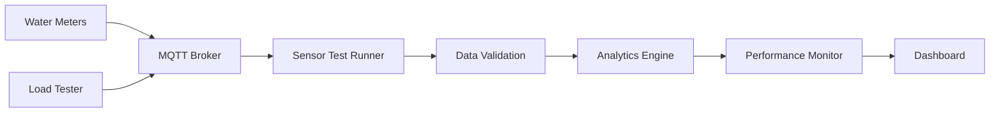

# Water Resource Optimization System

A robust, real-time water resource monitoring and optimization system designed to handle high-throughput sensor data with advanced anomaly detection and performance monitoring capabilities.

## 🌟 Features

### Real-time Data Processing
- MQTT-based sensor data ingestion
- Buffered processing with async implementation
- Configurable data validation and cleaning
- Support for high-frequency data streams

### Advanced Analytics
- Real-time anomaly detection using statistical methods
- Z-score based outlier detection
- Quality score validation
- Moving window statistics
- Multi-objective optimization capabilities

### Performance Monitoring
- Real-time metrics dashboard
- Processing time tracking
- Buffer size monitoring
- Error rate analysis
- Anomaly detection statistics

### Robust Error Handling
- Comprehensive data validation
- Graceful degradation under load
- Automatic reconnection logic
- Data quarantine for corrupt/invalid readings

## 🛠 Architecture

### Core Components

1. **Sensor Test Runner (`sensor_test_runner.py`)**
   - MQTT client integration
   - Data validation and processing
   - Real-time analytics
   - Error handling and logging

2. **Load Tester (`load_tester.py`)**
   - Configurable test patterns
   - Burst testing capabilities
   - Anomaly injection
   - Data corruption simulation

3. **Performance Monitor (`performance_monitor.py`)**
   - Real-time metric collection
   - Threshold monitoring
   - Alert generation
   - Performance logging

4. **Real-time Dashboard**
   - Processing time visualization
   - Buffer size tracking
   - Error rate monitoring
   - Anomaly detection display

## 📊 Data Flow



## 🚀 Getting Started

### Prerequisites
- Python 3.8+
- MQTT Broker (e.g., Mosquitto)
- Required Python packages:
  ```bash
  pip install paho-mqtt numpy pandas asyncio
  ```

### Installation

1. Clone the repository:
   ```bash
   git clone https://github.com/yourusername/water-resource-optimization.git
   cd water-resource-optimization
   ```

2. Install dependencies:
   ```bash
   pip install -r requirements.txt
   ```

3. Configure MQTT broker:
   ```bash
   sudo apt update
   sudo apt install mosquitto mosquitto-clients
   sudo systemctl start mosquitto
   ```

### Running the System

1. Start the performance monitor:
   ```bash
   python performance_monitor.py
   ```

2. Launch the sensor test runner:
   ```bash
   python sensor_test_runner.py
   ```

3. Start the load tester (for testing):
   ```bash
   python load_tester.py
   ```

## ⚙️ Configuration

### Sensor Test Runner
```python
config = SensorConfig(
    sensor_id="water_meter_001",
    z_score_threshold=2.5,
    quality_threshold=0.8,
    window_size=600
)
```

### Load Tester
```python
test_config = {
    "normal_data": 0.5,    # 50% normal data
    "anomalies": 0.15,     # 15% anomalies
    "noise": 0.15,         # 15% noisy data
    "missing": 0.1,        # 10% missing data
    "corrupt": 0.05,       # 5% corrupt data
    "burst": 0.05          # 5% data bursts
}
```

## 📈 Performance Metrics

### Processing Time
- Target: < 120ms
- P95: < 200ms
- Alert threshold: > 250ms

### Buffer Size
- Maximum: 1000 messages
- Warning threshold: 80% capacity
- Critical threshold: 95% capacity

### Error Rate
- Target: < 1%
- Warning threshold: 2%
- Critical threshold: 5%

## 🔧 Troubleshooting

### Common Issues

1. **High Processing Time**
   - Check async processing implementation
   - Verify buffer clearing
   - Monitor system resources

2. **Increased Error Rate**
   - Review data validation thresholds
   - Check sensor data quality
   - Verify MQTT connection stability

3. **Buffer Overflow**
   - Increase processing capacity
   - Adjust buffer size
   - Optimize data processing pipeline

## 📝 License

This project is licensed under the MIT License - see the [LICENSE](LICENSE) file for details.

## 🤝 Contributing

1. Fork the repository
2. Create your feature branch
3. Commit your changes
4. Push to the branch
5. Create a new Pull Request

## 📚 Documentation

For detailed documentation, see:
- [API Documentation](docs/API.md)
- [Configuration Guide](docs/Configuration.md)
- [Deployment Guide](docs/Deployment.md)

## 🏆 Acknowledgments

- MQTT protocol for reliable messaging
- Mosquitto for MQTT broker implementation
- Python async libraries for performance optimization
